```mermaid
graph LR
    A["Category / Property\nDefinitions"] --> B["Prompt\nGeneration"]
    B --> C["SD3.5 T5\nEmbeddings"]
    C --> D["Decoder-only\nSSAE Training"]
    D --> E["Sparse Feature\nSpace Y"]
    E --> F["Property\nEditing"]
    F --> G["Reconstructed\nEmbeddings"]
    G --> H["Image\nGeneration"]

    style A fill:#e0f2fe,stroke:#0284c7
    style B fill:#e0f2fe,stroke:#0284c7
    style C fill:#dbeafe,stroke:#2563eb
    style D fill:#c7d2fe,stroke:#4f46e5
    style E fill:#c7d2fe,stroke:#4f46e5
    style F fill:#fce7f3,stroke:#db2777
    style G fill:#fce7f3,stroke:#db2777
    style H fill:#fce7f3,stroke:#db2777
```

<div align="center">

# Decoder-Only Supervised Sparse Auto-Encoders

### Supervised Sparse Auto-Encoders as Unconstrained Feature Models for Semantic Composition

**Ouns El Harzli &middot; Hugo Wallner &middot; Yoonsoo Nam &middot; Haixuan Xavier Tao**

[](https://arxiv.org/abs/2602.00924)
[](LICENSE)
[](https://www.python.org/)
[](https://pytorch.org/)
[](https://huggingface.co/docs/diffusers)
[](https://ouns972.github.io/decoder-only-ssae/)

</div>

---



<div align="center">
<em>Results coming soon &mdash; placeholder for generated image comparisons.</em>
</div>

---

## Table of Contents

- [Overview](#overview)
- [Method](#method)
- [Installation](#installation)
- [Quick Start](#quick-start)
- [Detailed Usage Guide](#detailed-usage-guide)
  - [Step 1: Prompt Generation](#step-1-prompt-generation)
  - [Step 2: Embedding Extraction](#step-2-embedding-extraction)
  - [Step 3: Training](#step-3-training)
  - [Step 4: Inference & Image Generation](#step-4-inference--image-generation)
- [Configuration Reference](#configuration-reference)
- [Project Structure](#project-structure)
- [Citation](#citation)
- [License](#license)

---

## Overview

This repository implements **decoder-only Supervised Sparse Auto-Encoders (SSAEs)** for learning interpretable, compositional feature representations of text embeddings from Stable Diffusion 3.5 (T5-based encoder). Unlike standard autoencoders that learn both an encoder and a decoder, our approach trains only a decoder alongside a sparse latent feature space, enabling direct control over individual semantic properties.

The core idea is to define a structured set of **categories** (e.g., hair colour, pose, action) each containing discrete **properties** (e.g., "blond", "brunette"). Prompts are generated as combinatorial compositions of these properties, and their text embeddings are extracted via the SD3.5 T5 encoder. The decoder-only SSAE then learns a sparse feature matrix **Y** and a linear decoder **W** such that the reconstructed embedding preserves the semantic content of the original prompt.

Because the feature space is explicitly tied to known properties through a binary mask, individual features can be read, edited, or swapped to produce new embeddings -- and consequently new images -- with targeted semantic changes, all without retraining.

---

## Method

The decoder-only SSAE reconstructs an embedding **x** from a sparse feature vector as:

$$\hat{x}_i = W \cdot \sigma(M_i \odot Y_i) + b$$

where:
- **Y** is the learned sparse feature matrix (one row per prompt)
- **M** is a binary mask derived from the category/property structure
- **&sigma;** is a nonlinear activation (ReLU or LeakyReLU)
- **W** and **b** are the linear decoder weights and bias

```mermaid
graph LR
    Y["Y<sub>i</sub>\n(Sparse Features)"] --> MUL["&odot;\nMask"]
    M["M<sub>i</sub>\n(Binary Mask)"] --> MUL
    MUL --> ACT["&sigma;\n(Activation)"]
    ACT --> LIN["W &middot; + b\n(Linear Decoder)"]
    LIN --> X["x&#770;<sub>i</sub>\n(Reconstructed)"]

    style Y fill:#c7d2fe,stroke:#4f46e5
    style M fill:#fef3c7,stroke:#d97706
    style MUL fill:#f3f4f6,stroke:#6b7280
    style ACT fill:#f3f4f6,stroke:#6b7280
    style LIN fill:#dbeafe,stroke:#2563eb
    style X fill:#d1fae5,stroke:#059669
```



### Model Variants

The repository provides three decoder variants:

| Variant | File | Description |
|---|---|---|
| **Trainable Inputs** | `model_trainable_inputs.py` | Learns Y as a full `nn.Parameter` matrix. Supports shared features across prompts via `y_same`. Most flexible variant. |
| **Average Feature** | `model_avg_feature.py` | Uses `nn.Embedding` to represent per-property features that are composed via the mask. More parameter-efficient for large prompt sets. |
| **Inverse Least-Squares** | `model_trainable_input_inv.py` | Learns only Y; the decoder weight W is computed analytically via regularised least-squares (`W = (X^T X + λI)^{-1} X^T Y`). No gradient descent on W. |

---

## Installation

**Prerequisites:** Python 3.10+, CUDA-capable GPU (recommended for embedding extraction and training).

```bash
# Clone the repository
git clone https://github.com/ouns972/decoder-only-ssae.git
cd decoder-only-ssae

# Create and activate a virtual environment
python -m venv .venv
source .venv/bin/activate  # Linux/macOS
# .venv\Scripts\activate   # Windows

# Install dependencies
pip install -r requirements.txt
```

> **Note:** The requirements include PyTorch with CUDA 12.1 support. Adjust the `--extra-index-url` in `requirements.txt` if you need a different CUDA version.

---

## Quick Start

```bash
# 1. Generate combinatorial prompts from category/property definitions
python generate_prompts.py

# 2. Extract T5 text embeddings using Stable Diffusion 3.5
python get_embeddings_large_turbo_many_h5.py

# 3. Train the decoder-only SSAE
python training_cli.py --output_folder results/run1 \
    --path_yaml trainings/config/params_default.yaml \
    --overwrite_output True

# 4. Run inference interactively (see notebook)
jupyter notebook inference/notebooks/inference_and_testing_output_visuals.ipynb
```

---

## Detailed Usage Guide

### Step 1: Prompt Generation

Prompts are generated as combinatorial compositions of properties defined in a JSON file.

**Input:** `dataset_generation/prompts/input/categories_with_properties.json`

```json
{
    "hair": ["A blond girl", "A brunette girl"],
    "eyes": ["with blue eyes", "with brown eyes"],
    "situation": ["walking down the street", "sitting at a cafe", ...],
    "t_shirt": ["wearing a blue t-shirt", "wearing a black t-shirt", ...],
    "hat": ["and a hat", "and a baseball cap"],
    "action": ["holding a coffee", "holding a gun", ...],
    "pose": ["looking to the left", "looking to the right", ...]
}
```

The `PromptsGenerator` class in `dataset_generation/functions.py` computes all permutations across categories, shuffles them, and truncates to a specified count:

```bash
python generate_prompts.py
```

**Output:** A folder containing:
- `prompts.json` -- list of `{"id": ..., "prompt": ...}` entries
- `metadata.json` -- generation metadata (counts, seed)

Each prompt is a comma-separated concatenation of one property per category, e.g.:
> *"A blond girl, with blue eyes, sitting at a cafe, wearing a red t-shirt, and a hat, holding a coffee, looking to the left"*

### Step 2: Embedding Extraction

Text embeddings are extracted using the Stable Diffusion 3.5 pipeline with the T5 text encoder. The script uses **NF4 quantization** (via `bitsandbytes`) to fit the model in limited GPU memory.

```bash
python get_embeddings_large_turbo_many_h5.py
```

Edit the top of the script to configure your model ID, device, and paths. For each prompt, the script saves:
- `embds.h5` -- the T5 text embedding (flattened)
- `embds_pooled.h5` -- the pooled CLIP embedding (optional)
- `prompts.txt` -- the original prompt text

**Output structure:**
```
<folder_path>/
  prompts.json
  properties.json
  embds/
    embds_0/
      embds.h5
      embds_pooled.h5
      prompts.txt
    embds_1/
    ...
```

### Step 3: Training

Train the decoder-only SSAE using the CLI:

```bash
python training_cli.py \
    --output_folder results/my_run \
    --path_yaml trainings/config/params_default.yaml \
    --overwrite_output True
```

**Key CLI arguments:**

| Argument | Description |
|---|---|
| `--output_folder` | Directory for model checkpoint, logs, and plots |
| `--path_yaml` | Path to the YAML configuration file |
| `--overwrite_output` | Overwrite existing output folder if `True` |

**Training outputs:**
- `model.pt` -- saved model state dict
- `params.yaml` -- resolved configuration snapshot
- Training logs and loss plots (via the built-in `Logger`)

See [Configuration Reference](#configuration-reference) for all tunable hyperparameters.

### Step 4: Inference & Image Generation

The recommended workflow uses the Jupyter notebook at `inference/notebooks/inference_and_testing_output_visuals.ipynb`.

**1. Load the inference helper and image generator:**

```python
from inference.inference_model_avg import SFDInferenceModelAvg
from inference.image_generation.image_generator import ImageGenerator

sfd_inference = SFDInferenceModelAvg('results/my_run')
image_generator = ImageGenerator(simulated=False, device=device)
```

**2. Search for a prompt by properties:**

```python
idx, prompt = sfd_inference.search_idx_prompt([
    "A blond girl", "with blue eyes", "sitting in a bar", "holding a gun"
])
```

**3. Generate the original image from the prompt:**

```python
image_generator.generate_image_from_prompt(prompt=prompt, image_name='original.png')
```

**4. Reconstruct the embedding and generate from it:**

```python
embd = sfd_inference.get_x(idx=idx)
embd_full, pooled_embd = sfd_inference.overwrite_full_embedding(embd, idx=idx)

image_generator.generate_image_from_embd(
    prompt_embeds=embd_full.detach(),
    pooled_prompt_embeds=pooled_embd.detach(),
    image_name='reconstructed.png',
)
```

**5. Manual property editing:** The notebook demonstrates how to directly modify the mask `M` and the feature matrix `Y` to produce custom embeddings -- for example, swapping one property for another or interpolating between features.

---

## Configuration Reference

All training parameters are defined in `trainings/config/params_default.yaml`:

| Parameter | Default | Description |
|---|---|---|
| `model.model_name` | `"model_trainable_inputs"` | Decoder variant to use (`model_trainable_inputs`, `model_avg_feature`, `model_trainable_input_inv`) |
| `model.using_blocs` | `False` | Enable block-diagonal structure in the decoder |
| `dataloader.folder_path` | `"prompts/your_directory/"` | Path to the generated prompts + embeddings folder |
| `dataloader.truncate_n_prompts` | `null` | Limit number of prompts loaded (null = all) |
| `dataloader.truncate_embds_topk` | `1000` | Keep only top-k embedding dimensions by variance |
| `dataloader.add_property_is_the_same` | `True` | Add shared "is the same" property features |
| `dataloader.normalize` | `"MAX_MIN"` | Embedding normalization method |
| `dataloader.num_workers` | `1` | DataLoader worker threads |
| `dataloader.simulated.simulated` | `False` | Use simulated data for debugging |
| `dataloader.simulated.dim_clip_simulated` | `100` | Dimensionality of simulated embeddings |
| `training.n_epochs` | `1` | Number of training epochs |
| `training.print_frequency` | `1` | Print loss every N epochs |
| `training.save_model_frequency` | `null` | Save checkpoint every N epochs (null = end only) |
| `training.plot_frequency` | `1` | Generate plots every N epochs |
| `training.seed` | `0` | Random seed for reproducibility |
| `training.batch_size` | `16` | Training batch size |
| `training.lr` | `0.001` | Initial learning rate |
| `training.beta1` | `0.9` | Adam beta1 |
| `training.beta2` | `0.999` | Adam beta2 |
| `training.lr_scheduler.lr_scheduler_type` | `"LINEAR"` | Learning rate schedule type |
| `training.lr_scheduler.lr_scheduler_linear.lr_scheduler_lr_final_linear` | `0.0001` | Final learning rate for linear schedule |
| `sparse_feature_design.n_repeat` | `10` | Number of feature repetitions per property |

---

## Project Structure

```
decoder-only-ssae/
├── README.md
├── LICENSE
├── requirements.txt
├── generate_prompts.py                # Prompt generation entry point
├── get_embeddings_large_turbo_many_h5.py  # Embedding extraction script
├── training_cli.py                    # Training CLI entry point
├── trainable_inputs_all_clips.py      # Alternative training script
├── config/
│   └── models.yaml                    # Model configuration
├── dataset_generation/
│   ├── functions.py                   # PromptsGenerator class
│   └── prompts/input/
│       └── categories_with_properties.json  # Category/property definitions
├── inference/
│   ├── abstract.py                    # SFDInference base class
│   ├── inference_model_avg.py         # Inference with avg feature model
│   ├── inference_model_trainable_inputs.py  # Inference with trainable inputs
│   ├── utils.py                       # Inference utilities
│   ├── image_generation/
│   │   └── image_generator.py         # SD3.5 image generation wrapper
│   └── notebooks/
│       └── inference_and_testing_output_visuals.ipynb
├── trainings/
│   ├── config/
│   │   ├── config.py                  # Config parsing and initialization
│   │   └── params_default.yaml        # Default hyperparameters
│   ├── dataloader/
│   │   ├── dataloader.py              # H5Dataset for embeddings
│   │   ├── checks.py                  # Data validation
│   │   ├── utils.py                   # Dataloader utilities
│   │   └── properties/
│   │       ├── properties.py          # Property indexing
│   │       └── same_id.py             # Shared-property handling
│   ├── models/
│   │   ├── model_trainable_inputs.py  # Trainable inputs decoder
│   │   ├── model_avg_feature.py       # Average feature decoder
│   │   ├── model_trainable_input_inv.py  # Inverse least-squares decoder
│   │   └── utils.py                   # Model import utility
│   └── utils/
│       ├── common.py                  # Common utilities
│       ├── clip.py                    # CLIP-related helpers
│       ├── learning_rate_scheduler.py # LR scheduler
│       └── logger.py                  # Training logger
└── docs/                              # GitHub Pages project site
    ├── index.html
    ├── style.css
    └── .nojekyll
```

---

## Citation

If you use this code in your research, please cite:

```bibtex
@misc{harzli2026supervisedsparseautoencoders,
    title   = {Supervised Sparse Auto-Encoders as Unconstrained Feature Models
               for Semantic Composition},
    author  = {Ouns El Harzli and Hugo Wallner and Yoonsoo Nam
               and Haixuan Xavier Tao},
    year    = {2026},
    eprint  = {2602.00924},
    archivePrefix = {arXiv},
    primaryClass  = {cs.AI},
    url     = {https://arxiv.org/abs/2602.00924}
}
```

---

## License

This project is licensed under the [MIT License](LICENSE).
